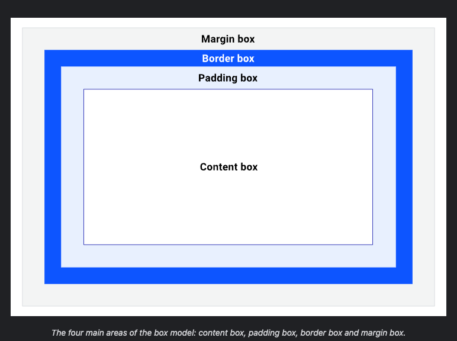

# Box Model

If I have below html

```html
<p>I am a paragraph of text that has a few words in it.</p>
```
and I write the below CSS

```css
p {
    width: 100px;
    height: 50px;
    padding: 20px;
    border: 1px solid;
}
```

- Example [Link](./box-model-example-1.html)

The content is breaking out the element and it is 142px wide, rather than 100px.


> Note: It's all boxes.


## Content and Sizing

> Boxes have different behaviour based on their `display` value, their set dimensions
> and the content that lives with in them

> Notice that when the box is using extrinsic sizing, there's a limit of how much 
> content you can add before it overflows out of the box's bounds. This makes 
> the word, "awesome", overflow.

```css
.awesome {
  text-transform: uppercase;
  font-size: 5rem;
  font-weight: 700;
  line-height: 1;
  border: 5px solid;
  padding: 2rem;

  /* The important extrinsic width */
  width: 400px;
}

.awesome[data-sizing="intrinsic"] {
  width: min-content;
}

/*

Presentational styles 
*/
.awesome {
  --flow-space: 2rem;
}
```

> Key Term:
> When content is too big for the box it is in, we call this overflow. 
> You can manage how an element handles overflow content, using the overflow property.


## The areas of the box model

- the padding box surrounds the content box and is the space created by the padding property.
- because padding is inside the box, the background of the box will be visible in the space that it creates.
- if box have `overflow` rules set, `overflow: auto` or `overflow: scroll`, the scrollbars will occupy this space.

- 

- the border box surrounds the padding box and its space is occupied by the border value.
- the [border](https://developer.mozilla.org/en-US/docs/Web/CSS/border) property is used to visually frame an element.

```html
<div>I have a border, an outline, and a box shadow! Amazing, isn't it?</div>
```

```css
div {
  border: 0.5rem outset pink;
  border-radius: 12px;
  font: bold 1rem sans-serif;
  margin: 3rem;
  box-shadow: 0 0 0 3rem skyblue;
  padding: 1rem;
  outline-offset: 0.5rem;
  outline: 0.5rem solid khaki;
}
```


- margin box is the space around the box, defined by the margin rule of the box.
- properties such as `outline` and `box-shadow` occupy the margin space too because they
  on the top, so they do not affect the size of the box.


## Controlling the box model


# References

- https://web.dev/learn/css/box-model/
- https://developer.mozilla.org/en-US/docs/Learn/CSS/Building_blocks/The_box_model
- https://andy-bell.co.uk/a-modern-css-reset/

